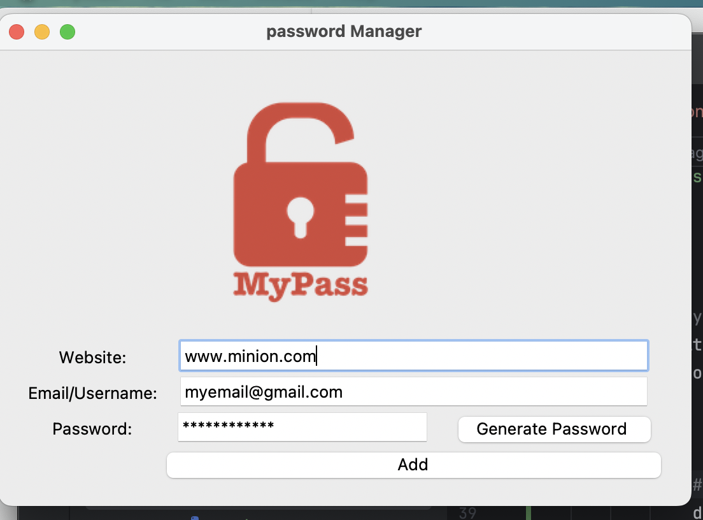

# password_manager
A simple password manager with random password generation and secure local saving. Built with Python and Tkinter.

## Features

- Generate secure random passwords
- Save credentials (website, email, password) locally in a JSON file
- Prevent overwriting existing entries by appending new data
- GUI interface built using Tkinter
- Auto-fill commonly used email address

## How to Run

1. Clone the repository:
   ```
   git clone https://github.com/yourusername/password_manager.git
   cd password_manager
   ```

2. Run the application:
   ```
   python main.py
   ```

## File Structure

- `main.py` – Main application script
- `data.json` – Stores saved login credentials
- `logo.png` – Logo used in the UI
- `README.md` – This file

## Screenshot



## Tech Stack

- Python 3.x
- Tkinter (for GUI)
- JSON (for data storage)

## License

This project is licensed under the MIT License.
